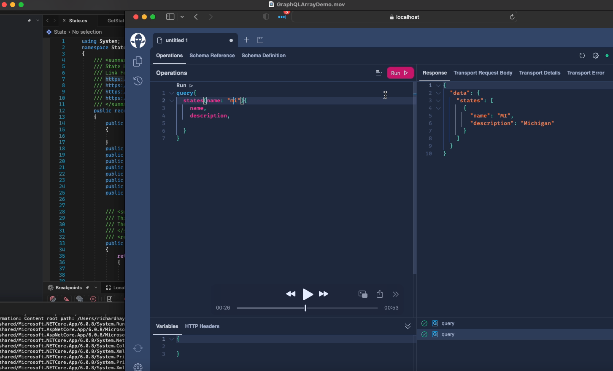

# Array Section
In this section we are going to demonstrate a practical use case for an array by creaing a [Graph QL](https://graphql.org) Api that can return a list of the states in the United States of America.
For those of you who are unfamliar with Graph QL it is as querying language protocal that APIs can use to gather data instead of having to use REST based methods to work with your API's data. It allows an API to have a single endpoint to gather or change data and allows a consumer of that API to dynamically specify what data they want. 

Since our API will be a list of states we will be build a "Smart Enum" to represent the list of states. Since the APIs use case if also very simple and not complicated we will be building a .Net 6 style minimal API as GraphQL works well in a minimal API. Below will be a list of reasons for choosing these technologies and techniques for this example.
## Reasons
1. Graph QL allows the API code to be very lightweight as we don't need controllers to access our data.
2. Since Our API is very simple a minimal API is a good approach since there are very few concerns the API needs to be concerned with such as authentication and authorization. 
3. We're using a [Enumeration Class](https://docs.microsoft.com/en-us/dotnet/architecture/microservices/microservice-ddd-cqrs-patterns/enumeration-classes-over-enum-types) or a ["Smart Enum"](https://www.youtube.com/watch?v=CEZ6cF8eoeg) because the list of states apart of the USA is extremly small containing only 50 values and hasn't changed in decades. It's in fact so small that it would be wastefull to have a database created just for that purpose alone.
4. An array is a great data structure here because since the list of US states won't be changing anytime soon and hasn't changed for so long it's pretty much static.
### State.cs
Below is the source code for the State Enumeration class. As you can see we are able to have a record for each state object we'd like to define in that single class. An also provide a function that will return all the options we provide but since the list is very small we are adding to it manually not dynamically.
```C#
using System;
namespace StatesApi.Models
{
    /// <summary>
    /// State Enumeration Listed in Order of Admission
    /// Link For Technique Details:
    /// https://docs.microsoft.com/en-us/dotnet/architecture/microservices/microservice-ddd-cqrs-patterns/enumeration-classes-over-enum-types
    /// https://www.youtube.com/watch?v=CEZ6cF8eoeg
    /// https://en.wikipedia.org/wiki/List_of_U.S._state_and_territory_abbreviations
    /// https://en.wikipedia.org/wiki/List_of_U.S._states_by_date_of_admission_to_the_Union
    /// </summary>
    public record State: Enumeration
    {
        public State(int id, string name, string description) : base(id, name, description)
        {

        }
        public static State Delware = new(id: 1, name: "DL", description: nameof(Delware));
        public static State Pennsylvania = new(id: 2, name: "PA", description: nameof(Pennsylvania));
        public static State NewJersey = new(id: 3, name:"NJ", description: nameof(NewJersey));
        public static State Georgia = new (id: 4, name: "GA", description: nameof(Georgia));
        public static State Connecticut = new(id: 5, name: "CT", description: nameof(Connecticut));
        public static State Massachusetts = new(id: 6, name: "MA", description: nameof(Massachusetts));
        public static State Maryland = new (id: 7, name: "MD", description: nameof(Maryland));
        public static State Michigan = new (id: 26, name: "MI", description:nameof(Michigan));


        /// <summary>
        /// This is a great use case for an array because all of the states will be static they won't be dynamic and its extremely unlikely that they will go beyond 50 values
        /// They can also be indexed in the order the where admitted into the Country
        /// </summary>
        /// <returns>Array of Enumeration Class of States</returns>
        public static State[] GetAll()
        {
            return new State[]
            {
                Delware,
                Pennsylvania,
                NewJersey,
                Georgia,
                Connecticut,
                Massachusetts,
                Maryland,
                Michigan,
            };
        }
    }
}


```
### GetStatesQuery.cs
Thanks to the power of GraphQL I can expose the data in that array to an API. That API will allow users to either find the state information they need by either searching for it's abbreviation (We've taken advantage of the StringComparison.OrdinalIgnoreCase to not be concerned about case sensitivety) or they can find the state by any letters in its name.
```C#
using System;
namespace StatesApi.Models
{
    public class GetStatesQuery
    {
        public IEnumerable<State> GetStates(string name)
        {
            return State.GetAll()
                .Where(state =>
                string.Equals(state.Name, name, StringComparison.OrdinalIgnoreCase )
                || state.Description.Contains(name));
        }
    }
}


```

